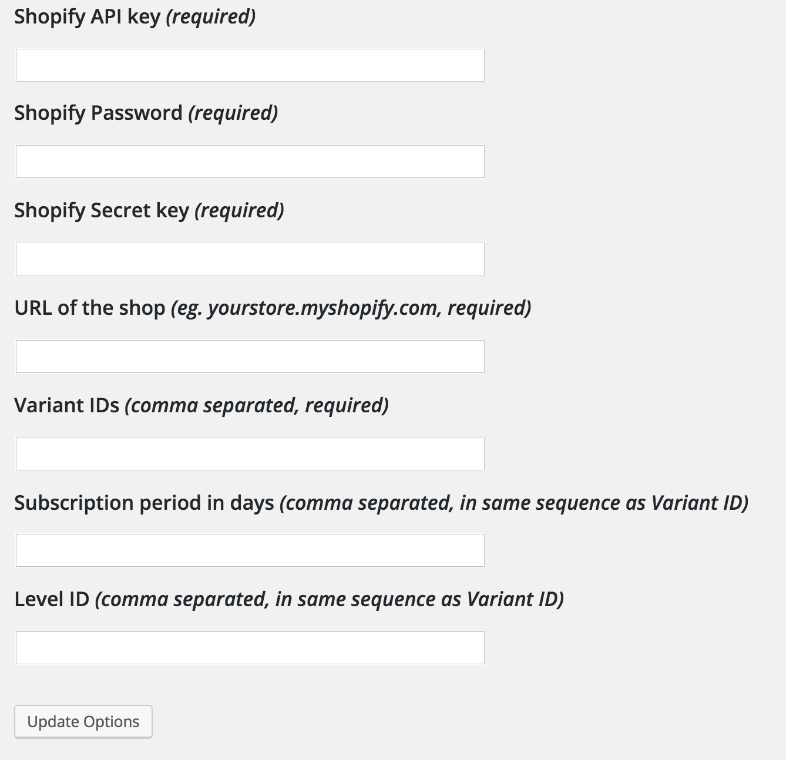

Leaky Paywall - Shopify Integration
==================================================

Wordpress plugin to be used with [Leaky Paywall](https://zeen101.com/leakypaywall/) and Shopify.
Checks if anybody has recently purchased products corresponding to a Shopify [Variant ID](https://help.shopify.com/themes/customization/products/find-variant-id) and enters their email address into LeakyPaywall/WordPress database.

Original by [maciejbis](https://github.com/maciejbis), updated to use Leaky Paywall's helper functions instead of writing SQL queries, expanded to support [multiple tiers and expiration dates](https://zeen101.com/downloads/leaky-paywall-multiple-levels/).
